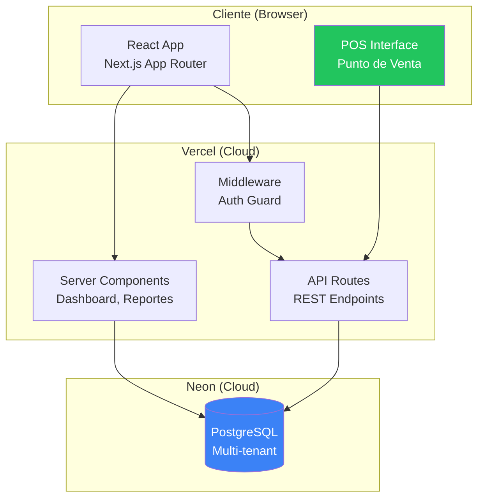
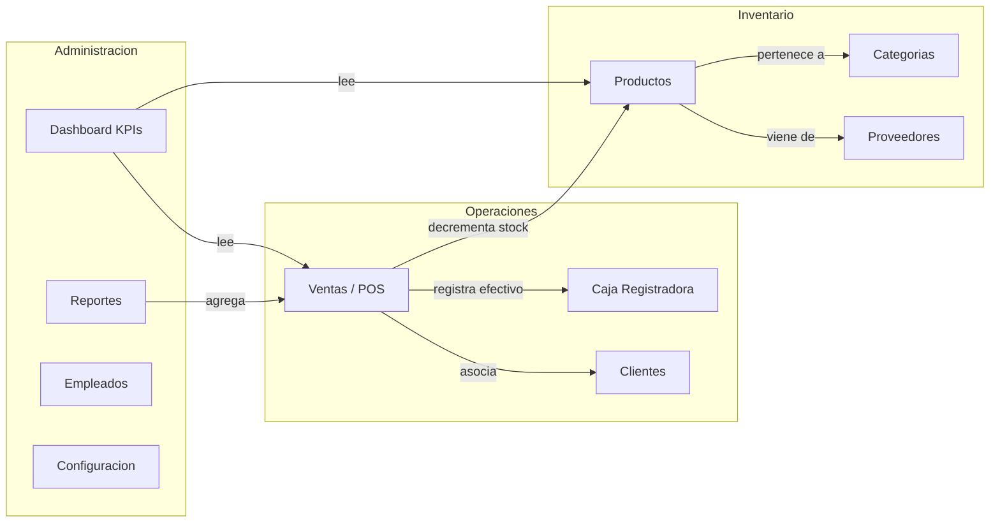
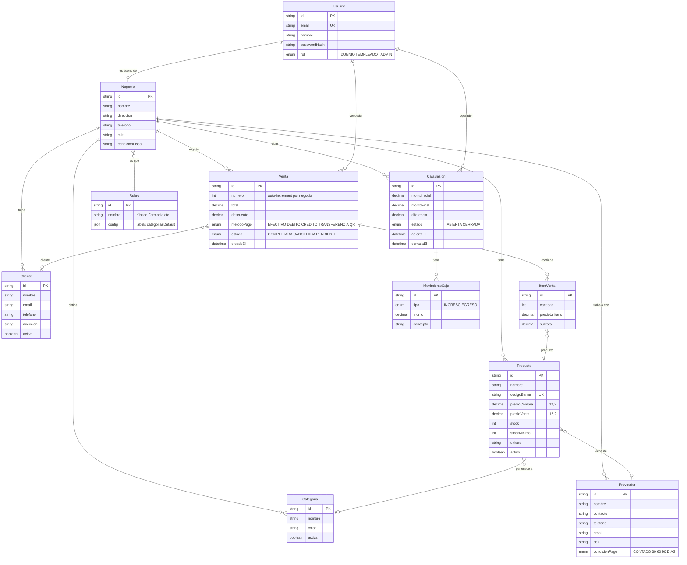
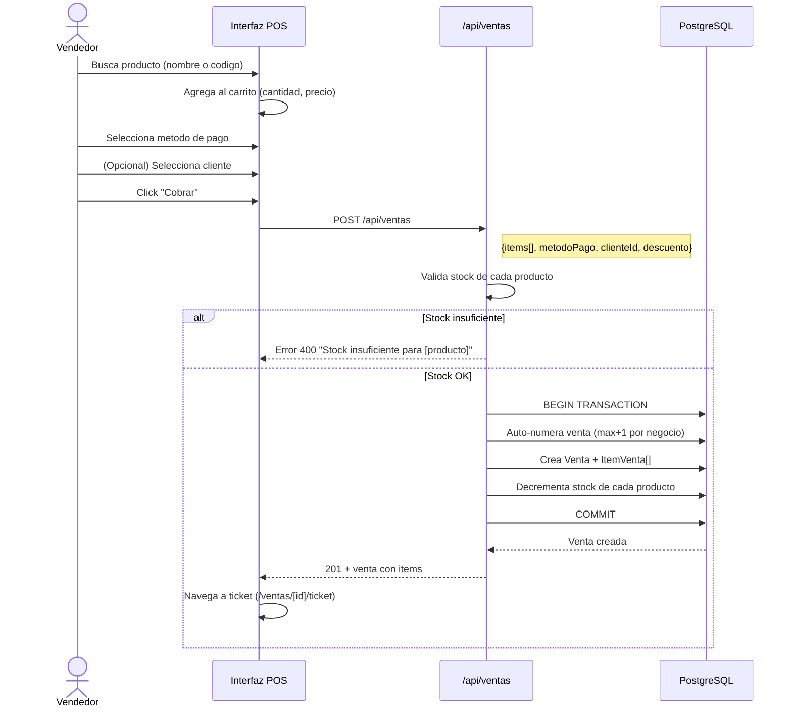
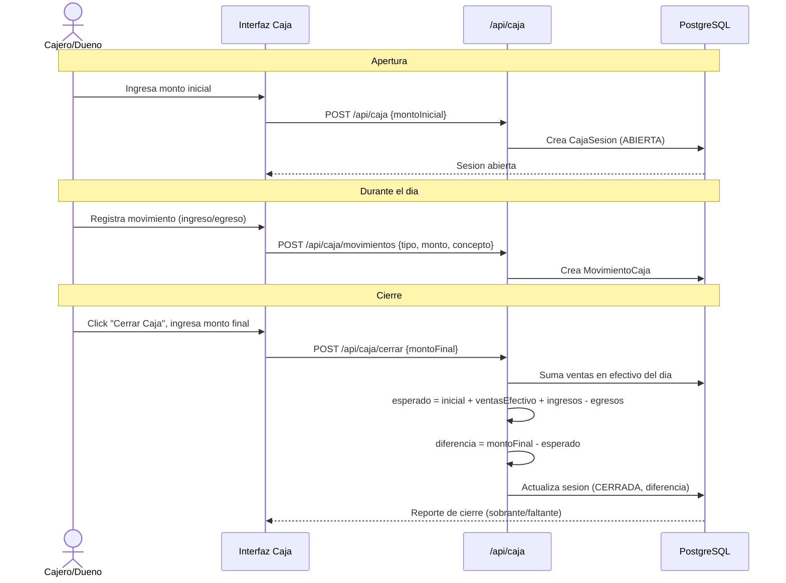
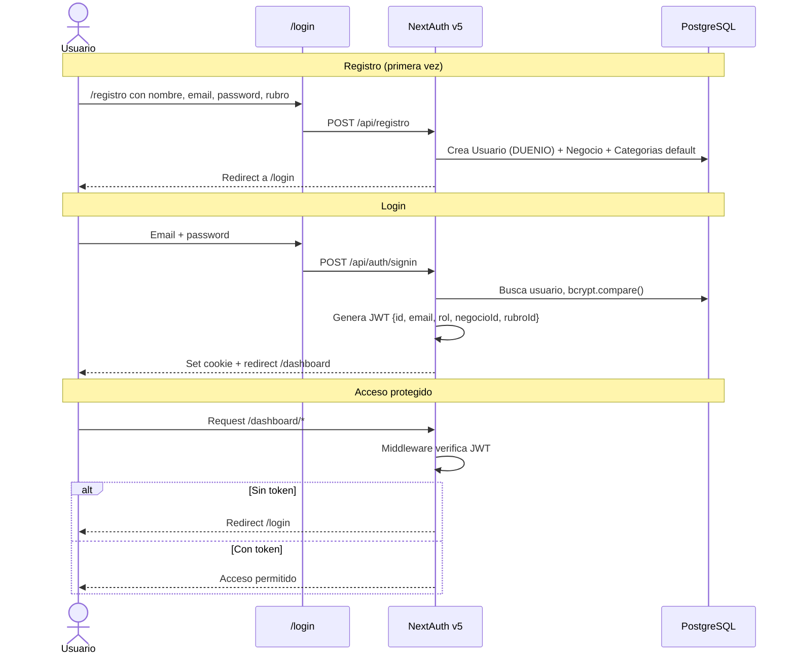
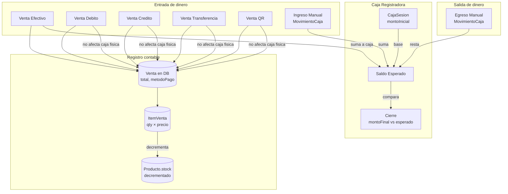

# GestioPro — Arquitectura del Sistema

> Documento tecnico para equipo de producto. Generado el 2026-03-08.
> Repo: github.com/MadRGE/gestiopro (public)
> Proposito: Gestion inteligente para negocios locales de barrio

---

## 1. Stack Tecnologico

| Capa | Tecnologia |
|------|-----------|
| Frontend | Next.js 16 (App Router) + React 19 + Tailwind CSS 4 |
| Componentes UI | shadcn/ui + Radix UI + Lucide Icons |
| Charts | Recharts |
| Backend | Next.js API Routes (serverless) |
| Base de datos | PostgreSQL (Neon, serverless) |
| ORM | Prisma 7 con @prisma/adapter-neon |
| Auth | NextAuth v5 (credentials + JWT) |
| Validacion | Zod 4 |
| Deploy | Vercel |

---

## 2. Diagrama de Arquitectura General

---

## 3. Modulos del Sistema

---

## 4. Esquema de Base de Datos

---

## 5. Flujo de Venta (POS)

---

## 6. Flujo de Caja Registradora

---

## 7. Flujo de Autenticacion

---

## 8. API Routes (Endpoints)

| Endpoint | Metodo | Rol minimo | Descripcion |
|----------|--------|-----------|------------|
| `/api/auth/[...nextauth]` | GET/POST | Publico | NextAuth handlers |
| `/api/registro` | POST | Publico | Registro usuario + negocio |
| `/api/rubros` | GET | Publico | Listar rubros disponibles |
| `/api/dashboard/stats` | GET | Autenticado | KPIs: ventas hoy, productos, alertas stock |
| `/api/ventas` | GET/POST | Autenticado | Listar/crear ventas |
| `/api/ventas/[id]` | GET/DELETE | Autenticado | Detalle/cancelar venta |
| `/api/productos` | GET/POST | GET: todos, POST: DUENIO | CRUD productos |
| `/api/productos/[id]` | PUT/DELETE | DUENIO | Editar/eliminar producto |
| `/api/categorias` | GET/POST | GET: todos, POST: DUENIO | CRUD categorias |
| `/api/categorias/[id]` | PUT/DELETE | DUENIO | Editar/eliminar categoria |
| `/api/clientes` | GET/POST | Autenticado | CRUD clientes |
| `/api/clientes/[id]` | PUT/DELETE | Autenticado | Editar/eliminar cliente |
| `/api/proveedores` | GET/POST | DUENIO | CRUD proveedores |
| `/api/proveedores/[id]` | PUT/DELETE | DUENIO | Editar/eliminar proveedor |
| `/api/empleados` | GET/POST | DUENIO | CRUD empleados |
| `/api/empleados/[id]` | PUT/DELETE | DUENIO | Editar/eliminar empleado |
| `/api/caja` | GET/POST | Autenticado | Ver/abrir sesion de caja |
| `/api/caja/cerrar` | POST | Autenticado | Cerrar caja con reconciliacion |
| `/api/caja/movimientos` | GET/POST | Autenticado | Movimientos de caja |
| `/api/caja/historial` | GET | Autenticado | Historial de sesiones |
| `/api/reportes` | GET | DUENIO | Reportes de ventas |
| `/api/configuracion` | GET/PUT | DUENIO | Config del negocio |
| `/api/configuracion/perfil` | GET/PUT | Autenticado | Perfil del usuario |

---

## 9. Reglas de Negocio

### Precios y Stock
- **precioCompra**: Costo del producto (para calcular margen)
- **precioVenta**: Precio de venta al publico (Decimal 12,2 — sin errores de punto flotante)
- **Margen** = (precioVenta - precioCompra) / precioVenta
- **stock**: Cantidad actual disponible
- **stockMinimo**: Umbral para alerta (dashboard muestra warning cuando stock <= stockMinimo)
- **No se puede vender si stock < cantidad solicitada** (error 400)
- Stock se decrementa automaticamente al crear venta (transaccional)

### Ventas
- Numero auto-incremental por negocio (no global)
- Estados: COMPLETADA, CANCELADA, PENDIENTE
- Metodos de pago: EFECTIVO, DEBITO, CREDITO, TRANSFERENCIA, QR
- Descuento opcional (se resta del total, total nunca < 0)
- Cada venta queda ligada al vendedor y opcionalmente al cliente
- Cancelar una venta NO restaura stock (decision de negocio)

### Caja
- Una sola sesion abierta por negocio a la vez
- Al cerrar: esperado = montoInicial + ventasEfectivo + ingresos - egresos
- Se reporta diferencia (faltante/sobrante)
- Historial auditable

### Multi-tenancy
- Todo filtrado por `negocioId` — un negocio nunca ve datos de otro
- Soft deletes (`activo: false`) para auditoria — no se borran registros

### Roles
- **DUENIO**: Todo (productos, empleados, reportes, proveedores, config)
- **EMPLEADO**: Ventas, clientes, caja (operaciones del dia a dia)
- **ADMIN**: Reservado para administracion del sistema

### Rubros (Tipos de Negocio)
- Kiosco, Farmacia, Ferreteria, Ropa, Panaderia, Peluqueria
- Cada rubro tiene config JSON con labels personalizados:
  - Farmacia: "Productos" → "Medicamentos", "Ventas" → "Dispensas"
  - Peluqueria: "Productos" → "Servicios", "Ventas" → "Atenciones"
- Categorias default se crean automaticamente al registrar negocio

---

## 10. Variables de Entorno

| Variable | Uso | Requerida |
|----------|-----|-----------|
| `DATABASE_URL` | Conexion a Neon PostgreSQL | Si |
| `NEXTAUTH_SECRET` | Secret para firmar JWT | Si |
| `NEXTAUTH_URL` | URL base de la app | Si |

---

## 11. Diagrama: Como viaja la plata

---

## 12. Metricas del Dashboard

| KPI | Calculo | Comparacion |
|-----|---------|-------------|
| Ventas del dia | SUM(total) WHERE fecha = hoy | vs ayer (% cambio) |
| Transacciones | COUNT(*) WHERE fecha = hoy | vs ayer |
| Productos activos | COUNT(*) WHERE activo = true | total |
| Alertas de stock | COUNT(*) WHERE stock <= stockMinimo | lista top 5 |

### Reportes disponibles
- Ventas por dia (ultimos 7+ dias, grafico de barras)
- Ventas por metodo de pago (pie chart)
- Top 5 productos mas vendidos
- Resumen: total facturado, cantidad de ventas, ticket promedio
